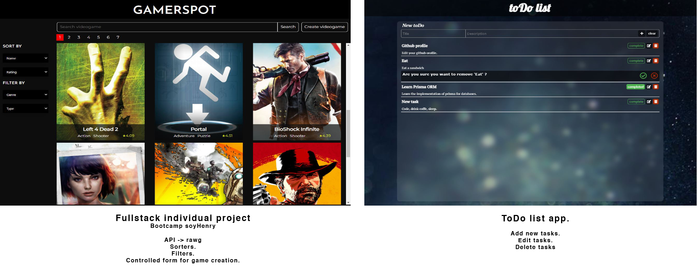

<h1 align="center">Hi , I'm Gonzalo</h1>
<h3 align="center">A fullstack developer in JavaScript from Argentina</h3>

---
<br/>
<h2>Here's a little about me:</h2>


```javascript 
const gonsoria = {
    stack: {
        frontEnd: ["JavaScript", "React.js", "Redux", "HTML5", "CSS"],
        backEnd: ["Node.js", "Express"],
        dataBase: ["Sequelize", "Prisma", "PostgreSQL"],
    },
    softSkills: ["problem solving", "collaborative", "creativity", "adaptability", "commitment"],
    currentlyLearning: "Typescript",
    hobbies: ["music", "football", "reading"]
};
```
<br/>

- 🔭 I’m currently working in a development team, in the backend area. 
- 😄 I’m looking to collaborate on **Web Development**.
- :books: I'm also studying Electronic Engineering in National University, La Plata.

<br/>


## Tech skills:

 


<p></p>
<p>&nbsp;</p>


<br/>

## Projects:

### PORTFOLIO
JavaScript | React | EmailJs | Chakra UI | i18next 

<p align="left">
  
</p>

<a href="https://gs-portfolio.vercel.app/" target="_blank">DEPLOY</a>

### NOKLER GAMES 
JavaScript | React | Redux | NodeJs | PostgreSQL | Expess | Prisma 

Home & gallery
<p align="left">
  
</p>

<p align="left">
  
</p>

<a href="https://nokler-noklerhenry.vercel.app/" target="_blank">DEPLOY</a>


<br/>

### MORE PROJECTS
GAMESPOT -->
JavaScript | React | Redux | NodeJs | Expess | PostgreSQL | Sequelize 

TODO LIST APP --> 
JavaScript | React | Redux

Home & gallery
<p align="left">
  
</p>


<br/>

---
##  Connect with me 

[](mailto:gonzalosoria.sg@gmail.com)
[](https://www.linkedin.com/in/gonzalosoria-fullstack-developer/)


<br/>
---


<h4 align="center">Visitor's count 👀</h4>
<p align="center"></p>

